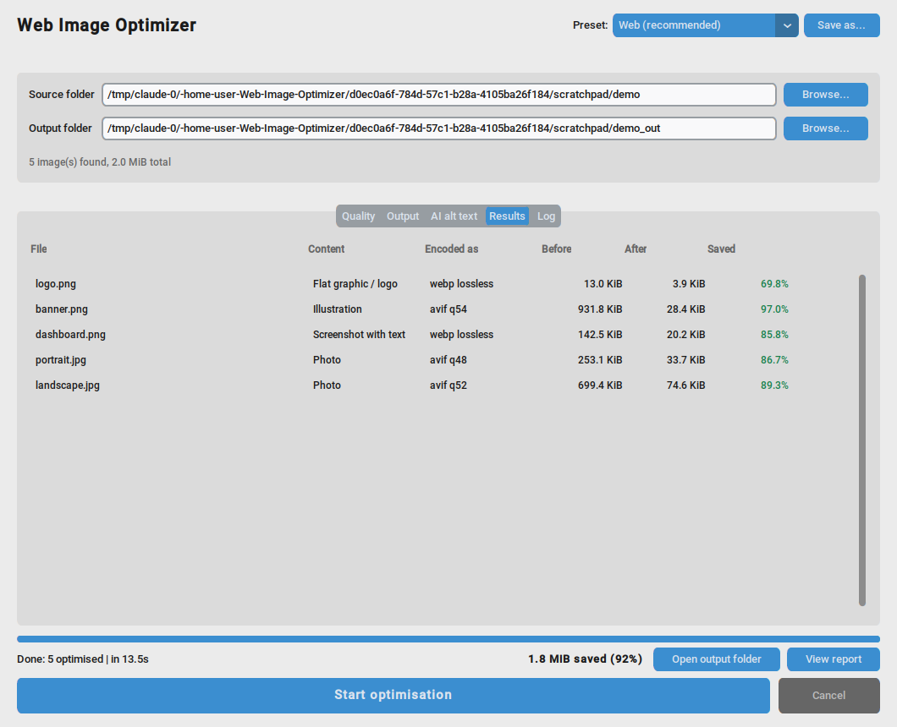
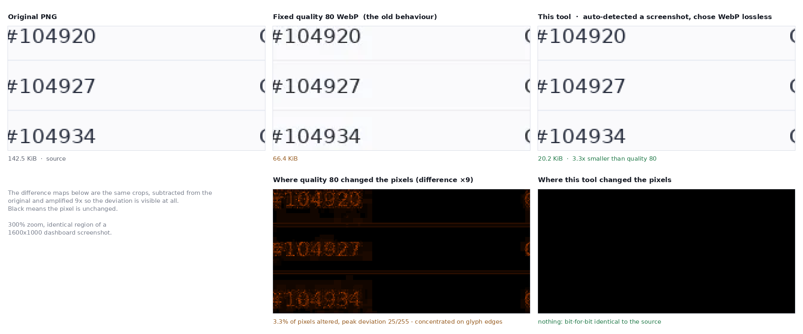
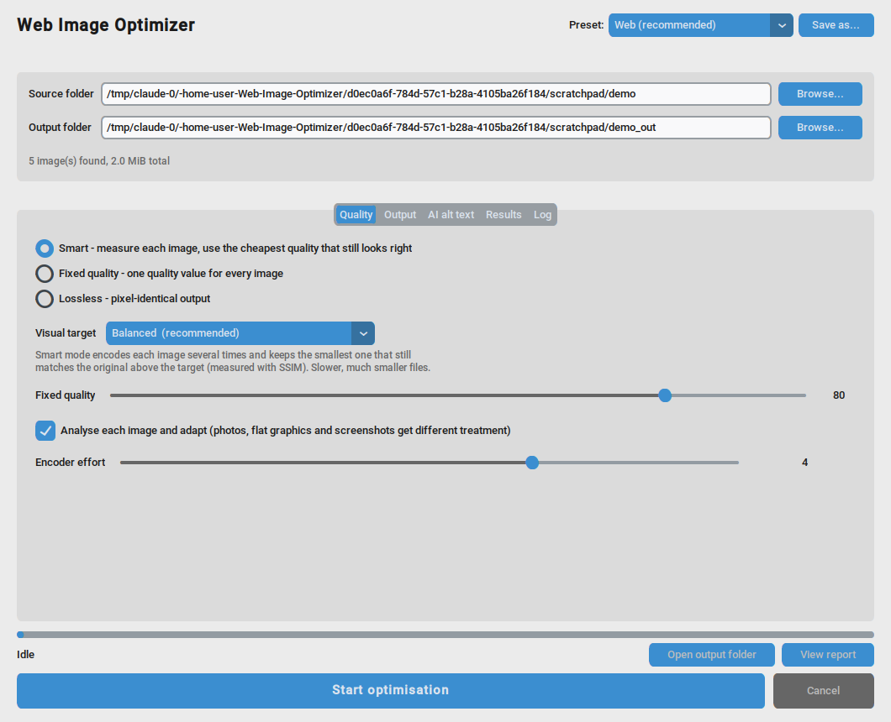
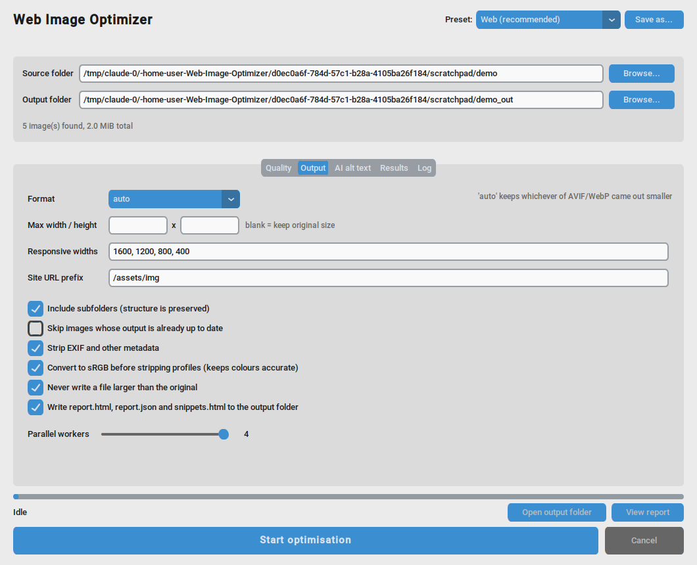
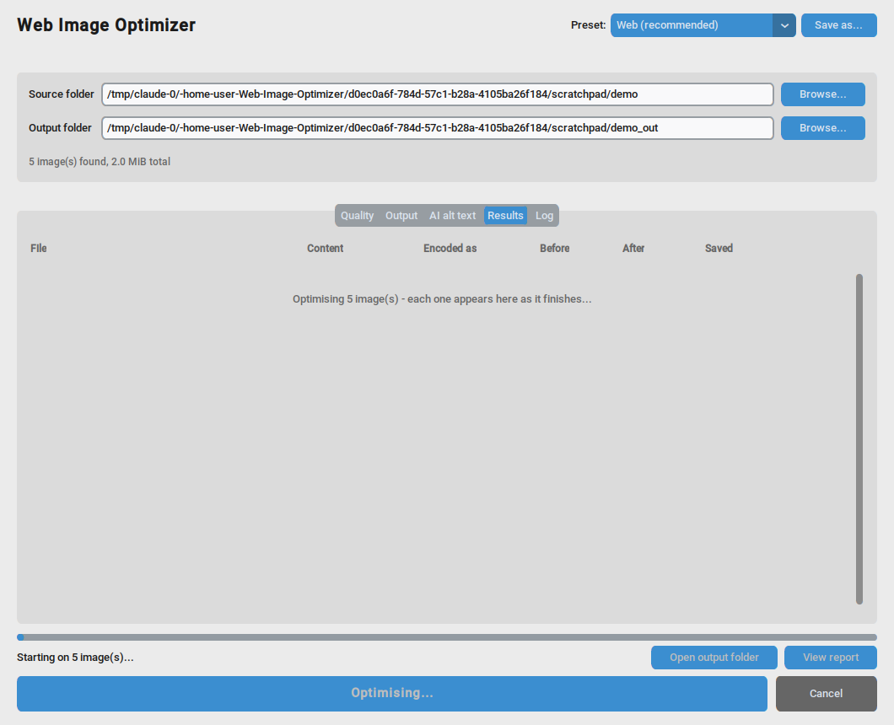
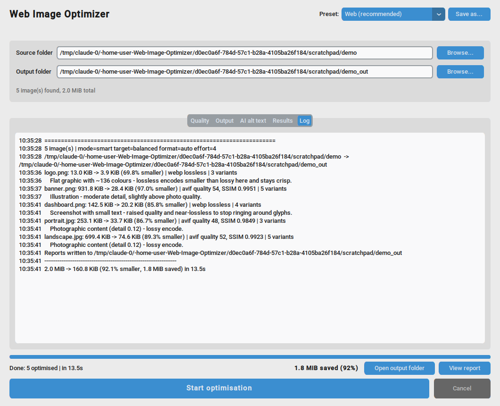
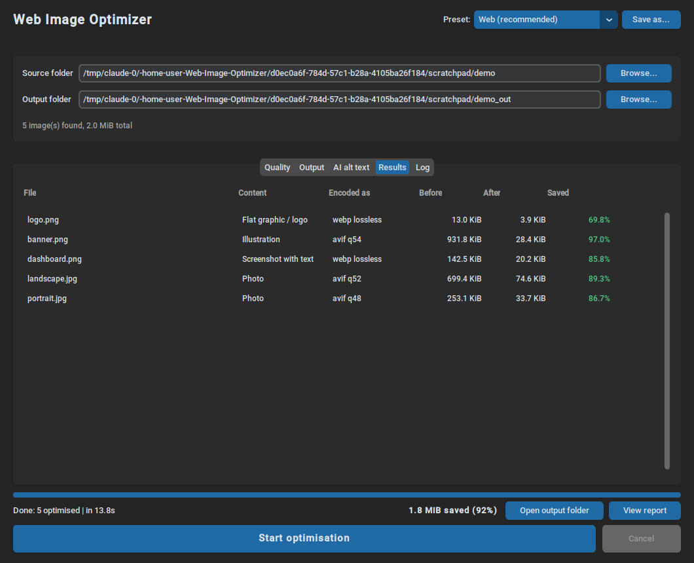
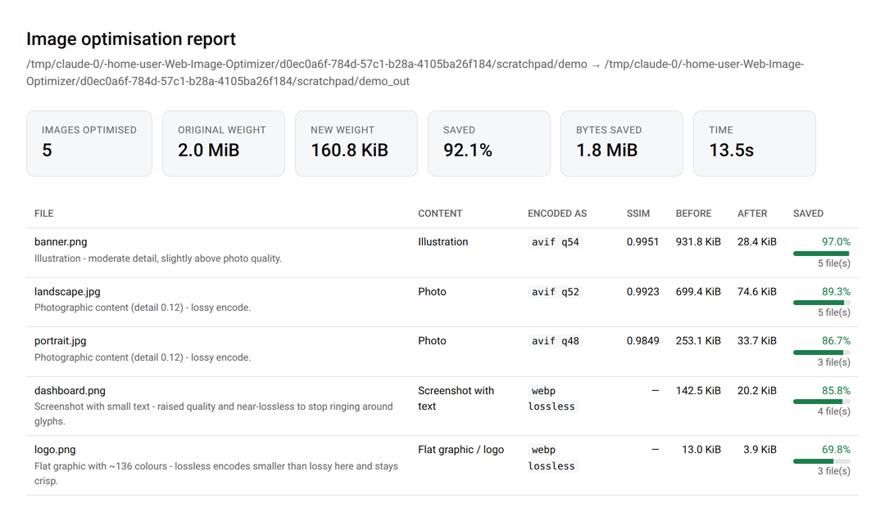
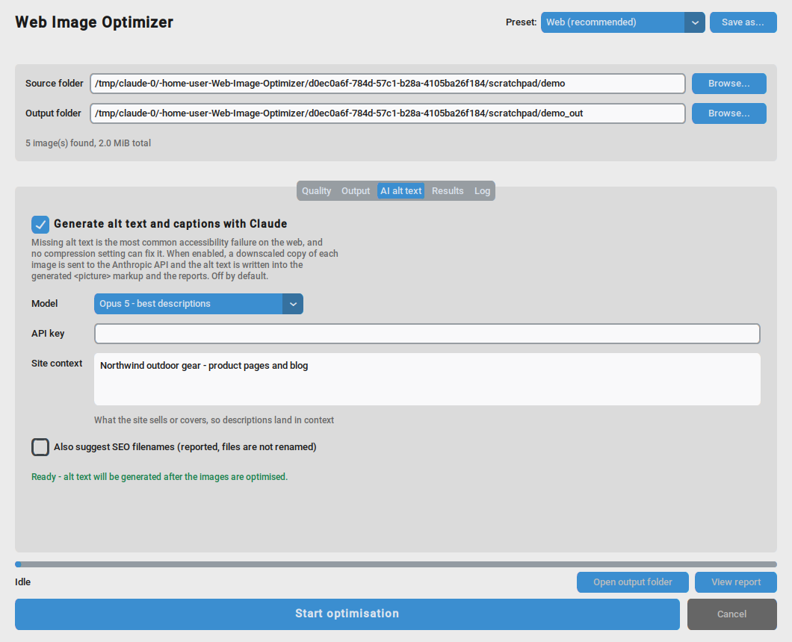

# Web Image Optimizer

**Author:** Lewis John Villamor

A desktop app and command-line tool that makes a folder of images ready for the
web. It works out what each image *is*, encodes it several ways, measures the
results, and keeps the smallest file that still looks right — then writes the
responsive sizes and the HTML to serve them.



On the five images in that run: **2.0 MiB → 160.8 KiB, 92% smaller**, in 14
seconds, with the logo and the dashboard screenshot coming out *pixel-identical*
to the originals.

---

## Table of contents

- [Why not just "convert everything to WebP at quality 80"](#why-not-just-convert-everything-to-webp-at-quality-80)
- [Install](#install)
- [Using the desktop app](#using-the-desktop-app-step-by-step)
- [What the settings actually do](#what-the-settings-actually-do)
- [Using the output on your site](#using-the-output-on-your-site)
- [The reports](#the-reports)
- [AI alt text](#ai-alt-text-optional)
- [Using the command line](#using-the-command-line)
- [Using it from Python](#using-it-from-python)
- [Recipes](#recipes)
- [Troubleshooting](#troubleshooting)
- [Limitations](#limitations)

---

## Why not just "convert everything to WebP at quality 80"

Because one quality number is a guess applied to every image, and it is wrong in
two directions at once — wasteful on soft photos, and visibly destructive on
screenshots, logos and anything containing text.

Here is the same region of a dashboard screenshot, encoded both ways. The bottom
row subtracts each result from the original and amplifies the difference so you
can see it at all; black means the pixel is untouched.



Quality 80 shreds every glyph edge to produce a **66 KiB** file. This tool
recognised a screenshot, chose lossless WebP, and produced a **20 KiB** file that
is bit-for-bit identical to the source. Smaller *and* perfect — the fixed-quality
setting was simply the wrong tool for that image.

**How it decides.** For each image:

1. **Analyse the pixels** — photo, illustration, flat graphic, or screenshot with
   text? Measured from edge density, colour spread and how much of the frame is
   flat.
2. **Encode it several ways** — AVIF and WebP, lossy and (for flat art) lossless.
3. **Score each result** against the original with SSIM, and **binary-search the
   quality scale** for the cheapest setting that still clears your visual target.
4. **Keep the smallest file** that passed. If nothing beat the original, the
   original is copied through untouched.

The cost is time: measuring is several times slower than blind conversion. The
search runs at a cheap encoder setting and only re-encodes the winner at full
effort, which keeps it to roughly 3× a fixed-quality run.

---

## Install

Python 3.9 or newer.

```bash
git clone https://github.com/lewisjohnvillamor/Web_Image_Optimizer.git
cd Web_Image_Optimizer

python -m venv venv
source venv/bin/activate          # Windows: venv\Scripts\activate

pip install -r requirements.txt
```

Then check what your machine can write:

```bash
python -m image_optimizer --list-formats
```

```
webp  yes
avif  yes
jpeg  yes
png   yes
```

If AVIF says `no`, run `pip install pillow-avif-plugin` — you will still get
WebP without it, just slightly larger files.

**Optional extras.** Everything runs without them:

| Extra | Gives you | Without it |
|---|---|---|
| `pillow-avif-plugin` | AVIF output, typically 20–30% smaller than WebP | AVIF is hidden, WebP is used |
| `anthropic` | AI alt text | The AI tab says it is unavailable |
| `customtkinter` | The desktop app | The CLI still works |

To install it as a package and get an `image-optimizer` command on your PATH:

```bash
pip install -e ".[all]"
```

> **Linux note:** the desktop app needs Tk. If `python image_optimizer_gui.py`
> reports `No module named 'tkinter'`, install it with
> `sudo apt install python3-tk` (Debian/Ubuntu) or
> `sudo dnf install python3-tkinter` (Fedora).

---

## Using the desktop app (step by step)

```bash
python image_optimizer_gui.py
```

### 1. Choose your folders and a preset



* **Source folder** — where your images are. Subfolders are included by default
  and the structure is preserved in the output.
* **Output folder** — where the optimised files go. **Use a different folder from
  your source.** The line underneath tells you how many images were found and
  what they currently weigh.
* **Preset** — start here. `Web (recommended)` is right for most sites; the full
  list is in [Recipes](#recipes). Picking a preset sets everything on the Quality
  and Output tabs for you.

### 2. Adjust anything you need on the Output tab



Most people change two things: **Responsive widths** (the sizes your layout
actually uses) and **Site URL prefix** (the path images live under on your site,
so the generated HTML points at the right place).

### 3. Press Start



Results stream in as each file finishes. **Cancel** stops the run — images
already written stay written.

### 4. Read what it did


Each row shows what the image was classified as, the setting it was given, and
what that saved. The **Log** tab explains *why* each decision was made:



Then **Open output folder** for the files, or **View report** for the summary
page.

The app follows your system light/dark setting:



Your settings, folders and any presets you save are remembered for next time.

---

## What the settings actually do

### Mode

| Mode | What it does | Use it when |
|---|---|---|
| **Smart** | Measures each image and searches for the cheapest quality that still hits your visual target | Almost always — this is the whole point of the tool |
| **Fixed quality** | One quality value for every image, no measuring | You need the fastest possible run, or you must match an existing pipeline exactly |
| **Lossless** | Pixel-identical output | Archival copies, or source assets you will edit again later |

### Visual target (Smart mode only)

How close the result must stay to the original, measured as SSIM:

| Target | Keeps | Good for |
|---|---|---|
| **Maximum** | ≥ 0.995 | Photography portfolios, print-adjacent work |
| **High** | ≥ 0.990 | Hero images, product shots |
| **Balanced** | ≥ 0.980 | Most website imagery — the default |
| **Smallest** | ≥ 0.965 | Thumbnails, listing grids, background images |

Lower targets mean smaller files. The SSIM the tool actually achieved is
recorded per image in the Results tab and both reports, so you can check.

### Analyse each image and adapt

Leave this on. It is what sends screenshots down the lossless path and lets busy
photos compress harder. Turning it off applies your mode and quality uniformly.

### Encoder effort (0–6)

CPU time versus file size. 4 is a good default; 6 is worth it for assets you ship
once and serve forever. It does not affect image quality, only how hard the
encoder works to hit it.

### Format

`auto` encodes both AVIF and WebP and keeps whichever came out smaller — the
right answer unless you have a specific reason. Choose a single format if your
CDN, CMS or browser support matrix requires one.

### Max width / height, and responsive widths

**Max width/height** caps the largest version. A 6000px camera original has no
business on a web page; 2000–2400px is plenty for full-bleed.

**Responsive widths** additionally writes a copy at each width you list, so
phones download a phone-sized file. `hero.jpg` with widths `1600, 800, 400`
produces `hero.avif`, `hero-1600w.avif`, `hero-800w.avif` and `hero-400w.avif`.
Widths larger than the source are skipped — it never upscales.

### The rest

* **Include subfolders** — walk the tree, preserving structure.
* **Skip images whose output is already up to date** — incremental builds. A
  second run over unchanged files costs one `stat()` per file, not a re-encode.
* **Strip EXIF and other metadata** — smaller files. Turn it off to keep camera
  data and copyright tags.
* **Convert to sRGB before stripping profiles** — leave this on. Without it,
  images tagged with a wide-gamut profile shift colour when the profile is
  dropped.
* **Never write a file larger than the original** — the safety net. If nothing we
  encode beats your source file, your source file is copied through instead.

---

## Using the output on your site

Optimised files only help if your pages actually reference them, so the tool
writes the markup for you. With "Write reports" on (or `--markup` on the CLI),
the output folder gets a `snippets.html` containing one block per image:

```html
<!-- landscape.jpg -->
<picture>
  <source type="image/avif"
          srcset="/assets/img/landscape-400w.avif 400w,
                  /assets/img/landscape-800w.avif 800w,
                  /assets/img/landscape-1200w.avif 1200w,
                  /assets/img/landscape-1600w.avif 1600w,
                  /assets/img/landscape.avif 2100w"
          sizes="100vw">
  
</picture>
```

Paste the block for an image where that image goes. What you get for free:

* **`srcset` + `sizes`** so the browser picks the right file for the device.
* **`width` and `height`** so the browser reserves space and the page does not
  jump while loading (no layout shift).
* **`loading="lazy"` and `decoding="async"`** so off-screen images do not block
  the initial render.
* **`alt`** — filled in if you enabled [AI alt text](#ai-alt-text-optional),
  otherwise left empty for you to write.

Set **Site URL prefix** (`--base-url`) to wherever the images will live, so the
paths are right the first time. Adjust `sizes` to match your layout — `100vw` is
correct for a full-width image but wrong for one in a sidebar; `--sizes` sets it
on the CLI.

---

## The reports

Every run can write three files into the output folder:

**`report.html`** — the human summary. Headline numbers, then every file with its
classification, the setting it was given, the SSIM it achieved and what it saved.



**`report.json`** — the same data for scripts and CI: per-file settings, sizes,
scores, the full content analysis, and every variant written.

**`snippets.html`** — the `<picture>` blocks described above.

`--csv` additionally writes a spreadsheet-friendly row per image.

---

## AI alt text (optional)

Compression makes images lighter. It cannot make them *usable*. Missing alt text
is the most common accessibility failure on the web, it is a WCAG requirement,
and no encoder setting will fix it — so the tool can write it for you with
Claude.



**Setup:** `pip install anthropic`, then set your key:

```bash
export ANTHROPIC_API_KEY=sk-ant-...      # Windows: setx ANTHROPIC_API_KEY sk-ant-...
```

or paste it into the API key box. The tab tells you whether it is ready before
you start a run.

**Site context** is worth filling in. "Independent bookshop in Manila" produces
noticeably more useful descriptions than no context at all, because it tells the
model what matters in the picture.

**What you get**, written into `snippets.html` and both reports:

* **Alt text** — one sentence, under 125 characters, describing what the image
  conveys. Decorative images correctly get *empty* alt text, which is the right
  answer for a screen reader rather than noise.
* **A caption** you can use as a figure caption or social description.
* **An SEO filename suggestion** — files are *not* renamed, since that would
  break links you already have. The suggestion is in the report.

**Model choice** is yours: Opus 5 for the best descriptions, Haiku 4.5 for
large batches at lower cost.

> ### Privacy
>
> Everything else in this tool runs entirely on your machine with no network
> access. Turning on AI alt text sends **a downscaled copy of each image**
> (max 768px, as JPEG) to the Anthropic API. It is **off by default**, and your
> API key is **never written to the config file**. Do not enable it for images
> you cannot share with a third-party service.

---

## Using the command line

Same engine, same presets, scriptable — for build pipelines and CI.

```bash
# The common case
python -m image_optimizer ./images ./dist

# A responsive set plus the markup to serve it
python -m image_optimizer ./images ./dist \
    --widths 1600,1200,800,400 --markup --base-url /assets/img

# A named preset, with reports
python -m image_optimizer ./images ./dist \
    --preset "E-commerce product shots" --html report.html --json report.json

# Incremental rebuild - unchanged files are skipped without re-encoding
python -m image_optimizer ./images ./dist --skip-existing

# See what would happen, change nothing
python -m image_optimizer ./images ./dist --dry-run
```

Typical output with `--verbose`:

```
Optimising 5 image(s) with 4 worker(s)...
  [1/5] logo.png: 13.0 KiB -> 3.9 KiB (-69.8%) webp lossless
  [2/5] banner.png: 931.8 KiB -> 28.4 KiB (-97.0%) avif q54 ssim 0.9951
  [3/5] dashboard.png: 142.5 KiB -> 20.2 KiB (-85.8%) webp lossless
  [4/5] portrait.jpg: 253.1 KiB -> 33.7 KiB (-86.7%) avif q48 ssim 0.9849
  [5/5] landscape.jpg: 699.4 KiB -> 74.6 KiB (-89.3%) avif q52 ssim 0.9923
Optimised 5 image(s) in 5.8s
  2.0 MiB -> 160.8 KiB (92.1% smaller, 1.8 MiB saved)
```

The exit code is non-zero if any file failed, so it works as a CI gate.

<details>
<summary><strong>All options</strong></summary>

| Flag | Does |
|---|---|
| `--preset NAME` | Start from a preset (`--list-presets` to see them) |
| `-f, --format` | `auto`, `webp`, `avif`, `jpeg`, `png` |
| `-m, --mode` | `smart`, `fixed`, `lossless` |
| `-t, --target` | `maximum`, `high`, `balanced`, `small` |
| `-q, --quality N` | Quality for `fixed` mode |
| `-e, --effort 0-6` | Encoder CPU budget |
| `--no-auto` | Disable per-image content analysis |
| `--max-width N`, `--max-height N` | Cap the largest output |
| `--widths 1600,800,400` | Also write these responsive widths |
| `--keep-metadata` | Keep EXIF and colour profiles |
| `--allow-larger` | Write output even if bigger than the source |
| `--skip-existing` | Incremental builds |
| `--no-recursive` | Do not descend into subfolders |
| `-j, --workers N` | Parallel workers |
| `--json`, `--csv`, `--html` | Write reports to these paths |
| `--markup [PATH]` | Write `<picture>` snippets |
| `--base-url`, `--sizes` | Fill in the markup correctly |
| `--alt-text` | Generate alt text with Claude |
| `--ai-model`, `--ai-context`, `--ai-concurrency` | Tune that |
| `--dry-run`, `-v`, `--quiet` | Run control |
| `--list-presets`, `--list-formats` | Inspect and exit |

</details>

---

## Using it from Python

```python
from image_optimizer import OptimizeSettings, run_batch

summary = run_batch(
    'src/images', 'dist/images',
    OptimizeSettings(output_format='auto', target='balanced',
                     widths=(1600, 800, 400)),
    progress=lambda p: print(f'{p.done}/{p.total} {p.current}'),
)

print(f'{summary.saved_ratio:.0%} smaller, {summary.saved_bytes:,} bytes saved')
for result in summary.succeeded:
    print(result.source, '->', result.primary.path, result.primary.score)
```

Also available: `optimize_file()` for a single image, `analyze()` for just the
content classification, and `ssim()` on its own if you want to score encodes
yourself.

---

## Recipes

| Preset | What it sets | Reach for it when |
|---|---|---|
| **Web (recommended)** | Smart, Balanced, `auto` format | Any normal website folder |
| **Hero / full-bleed** | Smart, High, capped 2400px, widths 2400/1600/1200/800 | Large above-the-fold imagery |
| **Thumbnails** | Smart, Smallest, WebP, capped 400px | Listing grids, avatars |
| **E-commerce product shots** | Smart, High, capped 2000px, widths 2000/1200/800/400 | Product galleries with zoom |
| **Maximum compression** | Smart, Smallest, effort 6 | Bandwidth matters more than fine detail |
| **Lossless / archival** | Lossless, metadata kept | Master copies you will edit again |
| **Legacy JPEG only** | Smart, JPEG output | A pipeline that cannot serve WebP or AVIF |

Configure anything you like and press **Save as...** to add your own. Presets are
plain JSON in the config file, so a team can share one:

| OS | Config file |
|---|---|
| Linux | `~/.config/web-image-optimizer/config.json` |
| macOS | `~/Library/Application Support/web-image-optimizer/config.json` |
| Windows | `%APPDATA%\web-image-optimizer\config.json` |

**In a build pipeline**, `--skip-existing` plus a committed output folder means
only changed images are re-encoded:

```bash
python -m image_optimizer src/images public/img \
    --preset "Web (recommended)" --widths 1600,800,400 \
    --skip-existing --markup --base-url /img --quiet
```

---

## Troubleshooting

**"No module named 'tkinter'"** — Tk is not installed for your Python. See the
Linux note under [Install](#install). The CLI works regardless.

**AVIF is missing from the format list** — `pip install pillow-avif-plugin`, or
upgrade to Pillow 11.3+ which includes it.

**A file came out *bigger*** — it can't, unless you passed `--allow-larger`. When
nothing we encode beats your source, the source is copied through and the report
says so. This happens with images that were already optimised.

**It is slower than I expected** — Smart mode encodes each image several times on
purpose. Lower the effort slider, use `--skip-existing` for rebuilds, or switch
to Fixed quality mode if you want the speed of blind conversion.

**Photos came out sideways in my old pipeline** — this version applies EXIF
orientation, so they won't here.

**Colours look washed out after optimising elsewhere** — that is a colour profile
being dropped rather than converted. Keep "Convert to sRGB before stripping
profiles" on, which is the default here.

**"the model declined to describe this image"** — the alt-text request was
refused for that one image. The optimised file is unaffected; write that alt text
by hand.

---

## Limitations

* Animated GIF/WebP is passed through at a fixed quality — the perceptual search
  runs on still images only.
* SSIM is a good, cheap proxy for visible difference, not a model of human
  vision. On very grainy or noisy sources no quality setting reaches a high
  target, so the tool falls back to the content analyser's recommendation rather
  than burning bytes chasing a score it cannot hit.
* Smart mode is several times slower than fixed-quality conversion. That is the
  cost of the file sizes above.
* SEO filenames are *suggested*, not applied — renaming would break existing
  links.
* CMYK and 16-bit-per-channel sources are converted to 8-bit sRGB.

**Supported input:** JPG/JPEG, PNG, WebP, AVIF, TIFF, BMP, GIF, PPM
**Output:** WebP, AVIF, JPEG, PNG

---

## Development

```bash
pip install -r requirements-dev.txt
python -m pytest
```

123 tests cover the perceptual metric, the content classifier, the encoder
(EXIF orientation, alpha handling, the never-larger guarantee), batch execution
and cancellation, the reports and markup, presets, the CLI, and the AI layer
against a fake client.

```
image_optimizer/
    analysis.py   what kind of image is this
    quality.py    SSIM and the per-image quality search
    engine.py     decode, correct, encode, verify one image
    batch.py      discovery, parallelism, cancellation
    report.py     JSON/CSV/HTML reports and <picture> markup
    ai.py         optional Claude alt text
    config.py     presets and persisted preferences
    cli.py        command line
image_optimizer_gui.py    desktop app - a thin layer over the package
```

All decisions live in the package, which is what the tests exercise; the GUI only
collects settings and renders results.

---

## Contributing

Issues and pull requests welcome. Please run `python -m pytest` before opening a
PR, and add a test for anything that changes encoder behaviour.

## License

MIT — see [LICENSE.md](LICENSE.md).

## Disclaimer

This software is provided "AS IS", without warranty of any kind, express or
implied. The author, Lewis John Villamor, is not liable for any claim, damages,
or other liability arising from, out of, or in connection with the software.
Keep backups of your originals, especially when the input and output folders are
the same.
